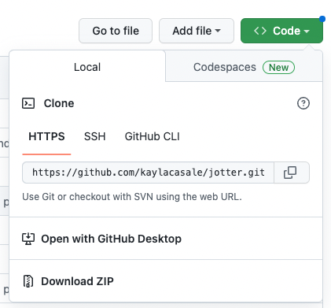
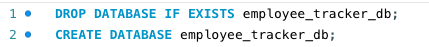
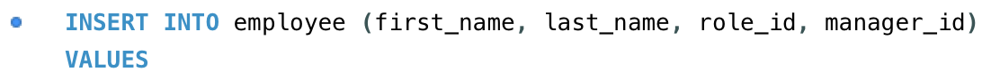
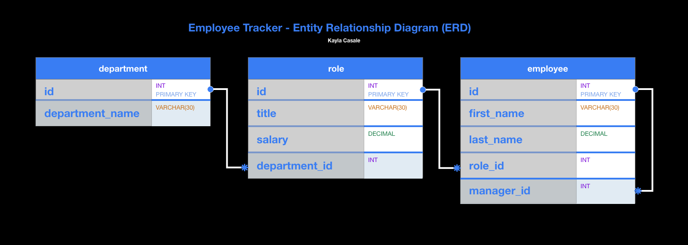

# track-your-work
A command-line application built from scratch to manage a company's employee database using Node.js, Inquirer, and MySQL.

## Employee Tracker
A content management system (CMS) for businesses to view and interact with information stored in their database. 

## User Story
```md
AS A business owner
I WANT to be able to view and manage the departments, roles, and employees in my company
SO THAT I can organize and plan my business
```

## Table of Contents
* [Description](#description)
* [Installation](#installation)
* [Usage](#usage)
* [Walk-through Video](#walk-through-video)
* [Built With](#built-with)
* [ERD](#erd)
* [Database - MySQL Tables](#database---mysql-tables)

## Description
A solution for managing a **company's departments, roles, and employees** in one simple platform. Built through the command-line, users can personalize their employee info using MySQL Workbench or through the prompts initiated when starting the application. The application is dynamic and suits companies both big and small, as there is no limit or minimum requirement for the amount of data stored in your employee_tracker_db.

## Installation
This application allows user to easily access, create, update, and delete departments, roles, and employees after 
- [x] Cloning the GitHub repository locally and
- [x] Installing necessary packages
- [x] Running schema.sql to create employee_tracker_db 
- [x] Running seeds.sql enter dynamic employee info (can personalize your database info)

1. To clone this project from GitHub to your local computer

> Click the Code drop-down button in this page and Copy URL for that repository:



> Enter the following command in your terminal on the level of your project folder (assuming you have Git installed)

    `git clone <URL>`
    > URL = https://github.com/kaylacasale/track-your-work.git


2. To install neccessary packages

This application uses Node.js, Inquirer, MySQL, and console.table in order to run on the command-line.

> Enter into the terminal in your source folder

    `npm install`

OR

    `npm i`


3. Create employee-tracker database in your MySQL Workbench

> Enter `schema.sql` content into your MySQL Workbench


...

> Enter `seeds.sql` content into your MySQL Workbench
>> **Personalize your seeds directly by entering your own employee information into the database or adding it through the command-line functions**
- for departments: 


...
- for roles:


...
- for employees:


...


## Usage

To start the application, run the following command(s) in the commend-line.

    `node server.js`

OR

    `npm run start`

This application lets you do the things:

    - View all departments, role, and employees through foreign keys
    - Add a department, role, or and/or employee (displaying dynamic choices by capturing ongoing and existing user input)
    - Update an employee's roles and/or manager
    - View employee by manager
    - View employee by department
    - Delete a department and/or role
    - View department budget
    - Enter unlimited information into your employee_tracker_db

### Walk-through Video 


https://user-images.githubusercontent.com/115776118/214040379-f1d59c7e-e266-4dbe-adad-421c29005eef.mp4


## Built With

> HTML
> CSS
> JavaScript

* Node.js
* Inquirer
* MySQL
* npm
    * console.table

* Bootstrap
* Adobe XD (design wireframe/ERD)

## ERD


## Database - MySQL Tables
- Example query in MySQL Workbench

```md
SELECT employee.id AS 'Employee ID', 
CONCAT (employee.first_name, ' ', employee.last_name) AS Name, 
role.title AS 'Job Title' ,
department.department_name AS 'Department',
role.salary AS 'Salary',
CONCAT (manager.first_name, ' ', manager.last_name) AS 'Manager'
FROM employee
LEFT JOIN role ON employee.role_id = role.id
LEFT JOIN department ON role.department_id = department.id
LEFT JOIN employee manager ON employee.manager_id = manager.id;
```
| Employee ID | Name                | Job Title           | Department        | Salary | Manager         |
|------------:|:-------------------:|:-------------------:|:-----------------:|:------:|:---------------:|
| 1           | Dennis Ritchie      | VP of Operations    | Operations        | 300000 | null            |
| 2           | Brian Kerringhan    | Graphic Designer    | Marketing         | 160000 | null            |
| 3           | Ada Lovelace        | Recruiter           | Human Resources   | 100000 | null            |
| 4           | Karen Jones         | Staff Coordinator   | Human Resources   | 60000  | Ava Lovelace    |


