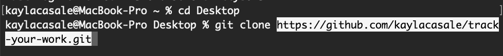

# track-your-work
A command-line application built from scratch to manage a company's employee database using Node.js, Inquirer, and MySQL.

## Employee Tracker
A content management system (CMS) for businesses to view and interact with information stored in their database. 

## User Story
```md
AS A business owner
I WANT to be able to view and manage the departments, roles, and employees in my company
SO THAT I can organize and plan my business
```

## Table of Contents
* [Description](#description)
* [Installation](#installation)
* [Usage](#usage)
* [Walk-through Video](#walk-through-video)
* [Built With](#built-with)


## Installation
This application allows user to easily access, create, update, and delete departments, roles, and employees after 
- [x] Cloning the GitHub repository locally and
- [x] Installing necessary packages
- [x] Running schema.sql to create employee_tracker_db 
- [x] Running seeds.sql enter dynamic employee info (can personalize your database info)

1. To clone this project from GitHub to your local computer


> Click the Code drop-down button in this page and Copy URL for that repository:


> Enter the following command in your terminal on the level of your project folder (assuming you have Git installed)

    `git clone <URL>`




2. To install neccessary packages

This application uses Node.js, Inquirer, MySQL, and console.table in order to run on the command-line.

> Enter into the terminal in your source folder

    `npm install`

OR

    `npm i`


3. Create employee-tracker database in your MySQL Workbench

> Enter `schema.sql` content into your MySQL Workbench


> Enter `seeds.sql` content into your MySQL Workbench
...

## Usage

To start the application, run the following command(s) in the commend-line.

    `node server.js`

OR

    `npm run start`

This application lets you do the things:

    - View all departments, role, and employees through foreign keys
    - Add a department, role, or employee, displaying dynamic choices capturing existing user input
    - Update an employee's roles or manager
    - View employee by manager
    - View employee by department
    - Delete a department or role
    - View department budget

### Walk-through Video 
[]


https://user-images.githubusercontent.com/115776118/214040379-f1d59c7e-e266-4dbe-adad-421c29005eef.mp4


## Built With

> HTML
> CSS
> JavaScript

* Node.js
* Inquirer
* MySQL
* npm
    * console.table

* Bootstrap
* Adobe XD (design wireframe)


